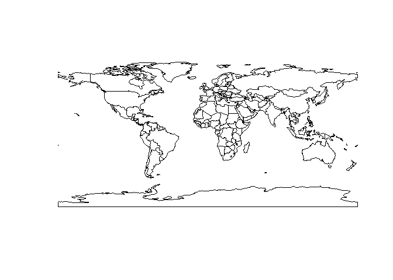
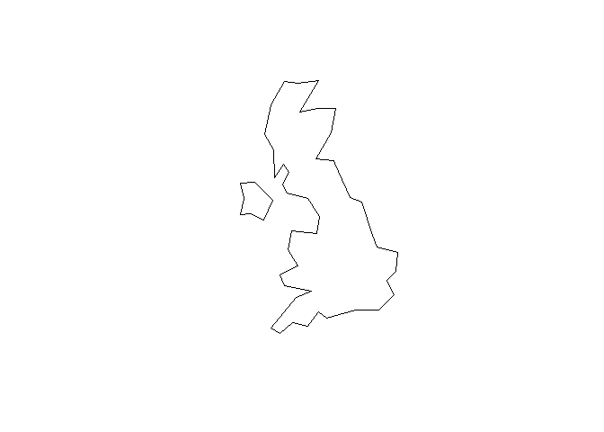
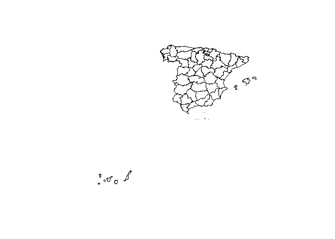

<!-- README.md is generated from README.Rmd. Please edit that file -->
[](https://travis-ci.org/ropenscilabs/rnaturalearth)

[](https://ci.appveyor.com/project/AndySouth/rnaturalearth)

rnaturalearth
=============

An R package to hold and facilitate interaction with [Natural Earth](http://www.naturalearthdata.com/) map data.

### Aims :

1.  access to a pre-downloaded subset of Natural Earth vectors commonly used in world mapping
2.  allow easy subsetting by countries and regions
3.  facilitate download of other Natural Earth vectors
4.  provide a simple, reproducible and sustainable workflow from Natural Earth data to rnaturalearth enabling updating as new versions become available
5.  to clarify differences in world maps classified by countries, sovereign states and map units
6.  to follow Natural Earth naming conventions so that rnaturalearth users can use Natural Earth documentation

The [Natural Earth](http://www.naturalearthdata.com/) website structures vector data by scale, category and type. These determine the filenames of downloads. rnaturalearth uses this structure to facilitate download (like an API).

### Install rnaturalearth

You can install the development version from GitHub using [devtools](https://github.com/hadley/devtools).

    devtools::install_github("ropenscilabs/rnaturalearth")

Data to support much of the package functionality are stored in two data packages that you will be prompted to install when required if you do not do so here.

    devtools::install_github("ropenscilabs/rnaturalearthdata")
    install.packages("rnaturalearthhires",
                     repos = "http://packages.ropensci.org",
                     type = "source")

### First Usage

Here using `sp::plot` as a simple, quick way to plot maps. Maps could also be made with `ggplot2`, `tmap` or other options.

``` r
library(rnaturalearth)
library(sp)

#world countries
sp::plot(ne_countries())
```



``` r
#uk
sp::plot(ne_countries(country = 'united kingdom'))
```



``` r
#states, admin level1 boundaries
sp::plot(ne_states(country = 'spain')) 
```



### Introductory vignette

``` r
vignette('rnaturalearth', package='rnaturalearth')
```

### To download Natural Earth data not already in the package

There are a wealth of other data available at the [Natural Earth](http://www.naturalearthdata.com/) website. `rnaturalearth` has functions to help with download of these data.

The data available are outlined in the two tables below and online [here](http://www.naturalearthdata.com/downloads/50m-physical-vectors/).


    category   cultural 
                                    type scale110 scale50 scale10
    1                          countries     TRUE    TRUE    TRUE
    2                          map_units     TRUE    TRUE    TRUE
    3                       map_subunits    FALSE    TRUE    TRUE
    4                        sovereignty     TRUE    TRUE    TRUE
    5                     tiny_countries     TRUE    TRUE    TRUE
    6                             states    FALSE    TRUE    TRUE
    7                   populated_places     TRUE    TRUE    TRUE
    8                boundary_lines_land     TRUE    TRUE    TRUE
    9                  pacific_groupings     TRUE    TRUE    TRUE
    10          breakaway_disputed_areas    FALSE    TRUE    TRUE
    11     boundary_lines_disputed_areas    FALSE    TRUE    TRUE
    12 boundary_lines_maritime_indicator    FALSE    TRUE    TRUE
    13                          airports    FALSE    TRUE    TRUE
    14                             ports    FALSE    TRUE    TRUE
    15                       urban_areas    FALSE    TRUE    TRUE
    16                             roads    FALSE   FALSE    TRUE
    17                         railroads    FALSE   FALSE    TRUE

    category   physical 
                              type scale110 scale50 scale10
    1                    coastline     TRUE    TRUE    TRUE
    2                         land     TRUE    TRUE    TRUE
    3                        ocean     TRUE    TRUE    TRUE
    4      rivers_lake_centerlines     TRUE    TRUE    TRUE
    5                        lakes     TRUE    TRUE    TRUE
    6              glaciated_areas     TRUE    TRUE    TRUE
    7  antarctic_ice_shelves_polys     TRUE    TRUE    TRUE
    8             geographic_lines     TRUE    TRUE    TRUE
    9                 graticules_1     TRUE    TRUE    TRUE
    10                graticules_5     TRUE    TRUE    TRUE
    11               graticules_10     TRUE    TRUE    TRUE
    12               graticules_15     TRUE    TRUE    TRUE
    13               graticules_20     TRUE    TRUE    TRUE
    14               graticules_30     TRUE    TRUE    TRUE
    15          wgs84_bounding_box     TRUE    TRUE    TRUE
    16                      playas    FALSE    TRUE    TRUE
    17               minor_islands    FALSE   FALSE    TRUE
    18                       reefs    FALSE   FALSE    TRUE

Specify the `scale`, `category` and `type` of the vector you want as in the examples below.

``` r
#lakes
lakes110 <- ne_download(scale = 110, type = 'lakes', category = 'physical')
sp::plot(lakes110)

#rivers
rivers50 <- ne_download(scale = 50, type = 'rivers_lake_centerlines', category = 'physical')
sp::plot(rivers50)
```

### Details of different country definitions and scales

``` r
vignette('what-is-a-country', package='rnaturalearth')
```

Reproducible download of Natural Earth data into the package
------------------------------------------------------------

[Script](https://github.com/ropenscilabs/rnaturalearthdata/blob/master/data-raw/data_download_script.r) used to get data into the accompanying data packages.

Acknowledgements
----------------

Thanks to [Lincoln Mullen](https://github.com/lmullen) for code structure inspiration from [USAboundaries](https://github.com/ropensci/USAboundaries), [Hadley Wickham](https://github.com/hadley) for comments and prompting, [Bob Rudis](https://github.com/hrbrmstr) for answers to stackoverflow questions about downloading Natural Earth data into R. The [Natural Earth team](http://www.naturalearthdata.com/about/contributors/) and [Nathan Kelso](https://github.com/nvkelso) for providing such a great resource.

Potential future work
---------------------

### potential additional data

1.  Country synonyms lookup
    -   dataframe with ISO3 and country synonyms
    -   similar to <https://github.com/AndySouth/rworldmap/blob/master/data/countrySynonyms.rda>

2.  Country larger regions lookup
    -   dataframe with ISO3 and membership of different regional groupings, e.g. continent, least developed countries etc.
    -   similar to <https://github.com/AndySouth/rworldmap/blob/master/data/countryRegions.rda>

### potential additional functions

1.  facilitate joining of user data to country boundaries
    -   similar to <https://github.com/AndySouth/rworldmap/blob/master/R/joinCountryData2Map.R>
    -   ... but with a better name
    -   similar allowing of join by ISO codes or names, with attempted synonym matching
    -   similar reporting of country joining success and failure

2.  facilitate subsetting by country groupings
    -   e.g. least developed countries etc.

[](http://ropensci.org)
